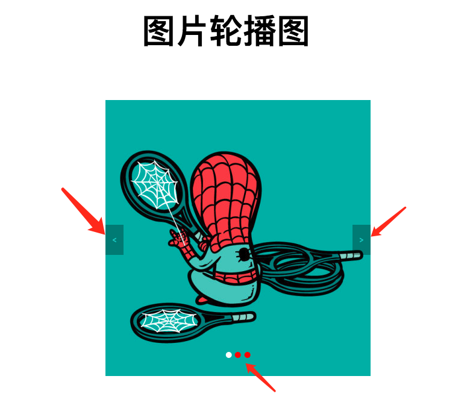

# 图片轮播图组件

图片轮播图组件
实现功能：
1. 点击左右标签进行图片切换
2. 点击图片下方小圆点进行图片切换
3. 图片自动轮播

下面是截图

## 使用手册

1. image-loop.js : 整个逻辑的JS调用
2. image-loop.css ：整个页面的css
3. image-loop.html ：HTML页面，
4. model.js : 一些写好的自己用的JS公用函数
5. jietu：这个文件夹放的是截图
6. sildeiamges:这个文件是轮播的图片源文件

### 项目使用条件

游览器，最好是Google chrome

## Running the tests

打开image_loop.html文件即可

## Authors

* ** 302wanger ** - *Initial work* - [PurpleBooth](https://github.com/302wanger)

## License

This project is licensed under the MIT License - see the [LICENSE.md](LICENSE.md) file for details

