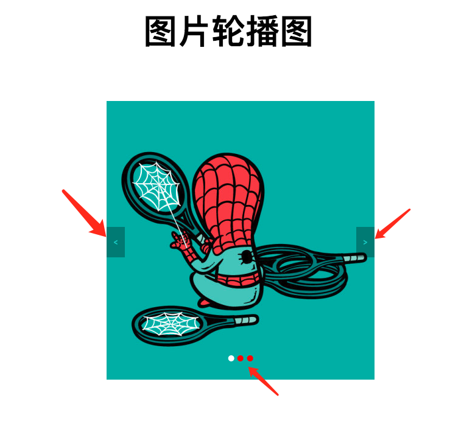
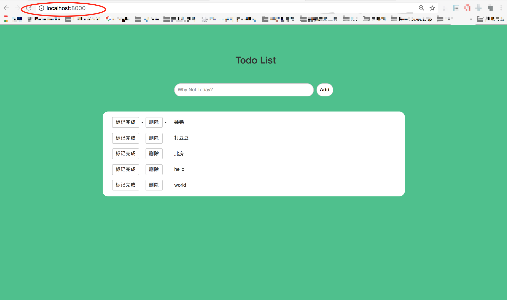
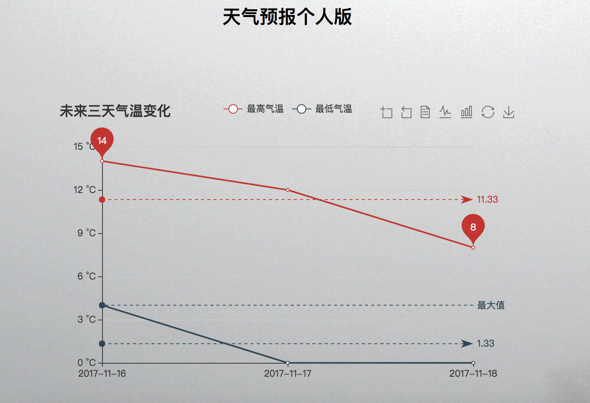
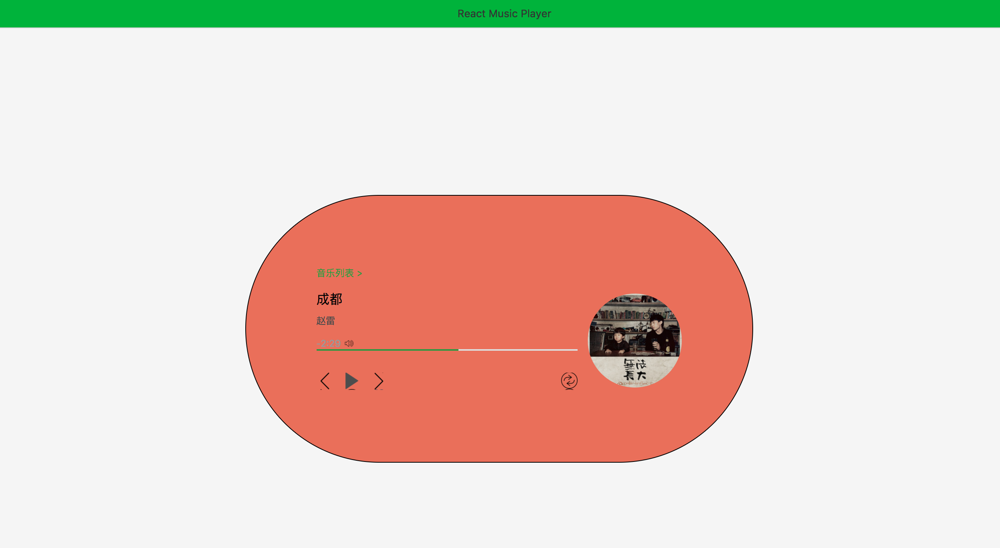

# FontXiangMuSum
自己写的前端项目的集合

提示：所有Node项目需在当前项目执行yarn install 安装依赖库后方可运行

目录：
1. 图片轮播图
2. 豆瓣数据可视化
3. Express实现todo应用
4. 豆瓣Top250数据爬虫
5. 微信小程序静态页面demo
6. 网页版天气预报
7. React音乐播放器
8. 个人静态网站：http://www.redwangpangzi.com
9. 利用Node和构建的多人博客项目

## 1.图片轮播图

实现功能：
1. 点击左右标签进行图片切换
2. 点击图片下方小圆点进行图片切换
3. 图片自动轮播

## 2.豆瓣数据可视化

## 3.Express实现todo应用

## 6.网页版天气预报

## 7.React音乐播放器

