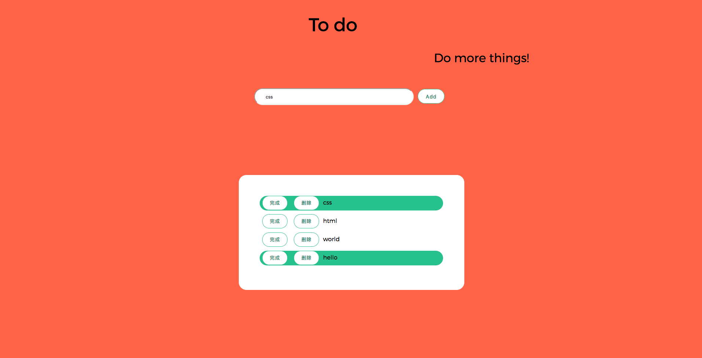

# web-todo-list
Use JavaScript and HTML and CSS to write a web todo-list app

todo 应用的流程
1. 进入页面, 首先调用 loadTodos 获取所有存储的 todos, 并且赋值给变量 todos
2. 拿到 todos 之后, 我们把这些 todos 插入到页面中
3. 点击 add 的时候, 我们做两件事情
    a. 把 todo 保存到 localStorage 里面
    b. 把 todo 显示在页面中
4. 点击 delete 的时候, 我们也做了两件事情
    a. 从 localStorage 里面删除相应的 todo
    b. 从页面中删除相应的 todo